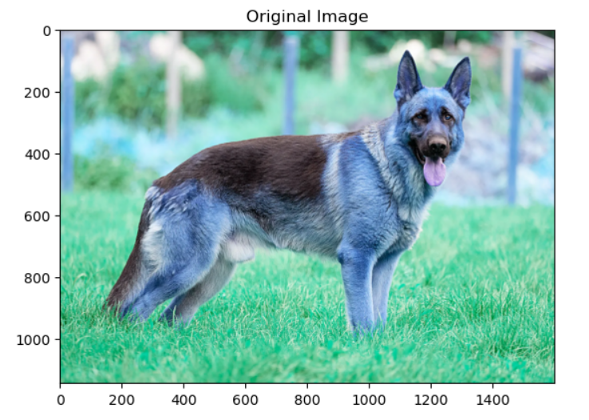
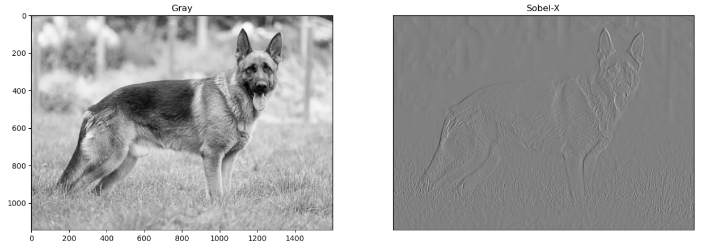
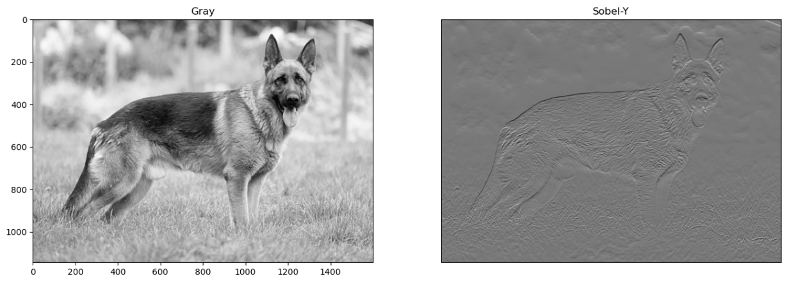
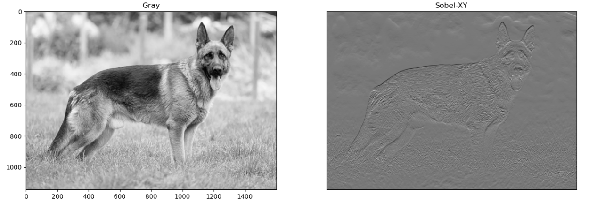
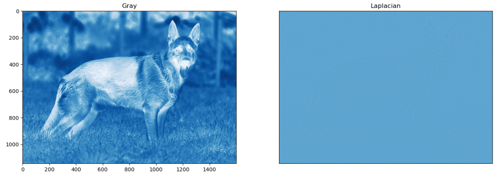
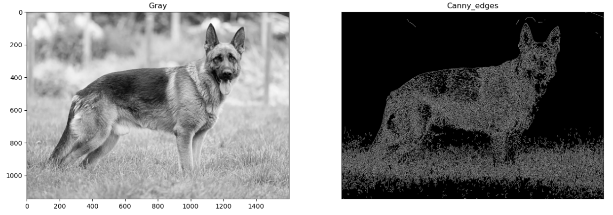

# Edge-Detection
## Aim:
To perform edge detection using Sobel, Laplacian, and Canny edge detectors.

## Software Required:
Anaconda - Python 3.7

## Algorithm:
### Step1:
<br>
Import the necessary packages matplolib and cv2.

### Step2:
<br>
Read the image as grayscale and reduce the noise using cv2.GaussianBlur.

### Step3:
<br>
Perform various methods of edge detection Sobel edge detector,Laplacian edge detector,Canny edge detector.

### Step4:
<br>
Run the program.

### Step5:
<br>
Execute the output.
 
## Program:

#### Developed by : Sarankumar J
#### Register Number : 212221230087
``` Python
# Import the packages
import cv2
import matplotlib.pyplot as plt

# Import the packages and load the image, Convert to grayscale and remove noise:
image = cv2.imread("dog.webp")
plt.title('Original Image')
plt.imshow(image)
gray_image = cv2.cvtColor(image,cv2.COLOR_BGR2GRAY)
new_image = cv2.GaussianBlur(gray_image,(3,3),0)

# SOBEL EDGE DETECTOR:

# SOBEL-X:
import cv2
import matplotlib.pyplot as plt
image=cv2.imread("dog.webp")
gray_img=cv2.cvtColor(image,cv2.COLOR_BGR2GRAY)
img=cv2.GaussianBlur(gray_img,(3,3),0)
sobelx=cv2.Sobel(img,cv2.CV_64F,1,0,ksize=5)
plt.figure(figsize=(16,16))
plt.subplot(1,2,1)
plt.imshow(img,cmap='gray')
plt.title('Gray')
plt.subplot(1,2,2)
plt.imshow(sobelx,cmap='gray')
plt.title("Sobel-X")
plt.xticks([])
plt.yticks([])
plt.show()

# SOBEL-Y:
import cv2
import matplotlib.pyplot as plt
image=cv2.imread("dog.webp")
gray_img=cv2.cvtColor(image,cv2.COLOR_BGR2GRAY)
img=cv2.GaussianBlur(gray_img,(3,3),0)
sobely=cv2.Sobel(img,cv2.CV_64F,0,1,ksize=5)
plt.figure(figsize=(16,16))
plt.subplot(1,2,1)
plt.imshow(img,cmap='gray')
plt.title('Gray')
plt.subplot(1,2,2)
plt.imshow(sobely,cmap='gray')
plt.title("Sobel-Y")
plt.xticks([])
plt.yticks([])
plt.show()

# SOBEL-XY:
import cv2
import matplotlib.pyplot as plt
image=cv2.imread("dog.webp")
gray_img=cv2.cvtColor(image,cv2.COLOR_BGR2GRAY)
img=cv2.GaussianBlur(gray_img,(3,3),0)
sobelxy=cv2.Sobel(img,cv2.CV_64F,0,1,ksize=5)
plt.figure(figsize=(16,16))
plt.subplot(1,2,1)
plt.imshow(img,cmap='gray')
plt.title('Gray')
plt.subplot(1,2,2)
plt.imshow(sobelxy,cmap='gray')
plt.title("Sobel-XY")
plt.xticks([])
plt.yticks([])
plt.show()


# LAPLACIAN EDGE DETECTOR:

import cv2
import matplotlib.pyplot as plt
image=cv2.imread("dog.webp")
gray_img=cv2.cvtColor(image,cv2.COLOR_BGR2GRAY)
img=cv2.GaussianBlur(gray_img,(3,3),0)
laplacian = cv2.Laplacian(img,cv2.CV_64F)
plt.figure(figsize=(16,16))
plt.subplot(1,2,1)
plt.imshow(img,cmap='Blues')
plt.title('Gray')
plt.subplot(1,2,2)
plt.imshow(laplacian,cmap='Blues')
plt.title("Laplacian")
plt.xticks([])
plt.yticks([])
plt.show()

# CANNY EDGE DETECTOR:
import cv2
import matplotlib.pyplot as plt
image=cv2.imread("dog.webp")
gray_img=cv2.cvtColor(image,cv2.COLOR_BGR2GRAY)
img=cv2.GaussianBlur(gray_img,(3,3),0)
canny_edges = cv2.Canny(image, 120, 150)
plt.figure(figsize=(16,16))
plt.subplot(1,2,1)
plt.imshow(img,cmap='gray')
plt.title('Gray')
plt.subplot(1,2,2)
plt.imshow(canny_edges,cmap='gray')
plt.title("Canny_edges")
plt.xticks([])
plt.yticks([])
plt.show()
```
## Output:

### SOBEL EDGE DETECTOR
### SOBEL-X

### SOBEL-Y

### SOBEL-XY

### LAPLACIAN EDGE DETECTOR

### CANNY EDGE DETECTOR


## Result:
Thus the edges are detected using Sobel, Laplacian, and Canny edge detectors.
